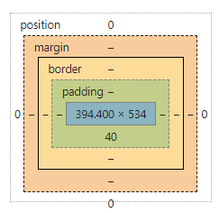

# 概述 

层叠样式表（Cascading Style Sheets）

CSS定义的东西，更以更美观地显示 HTML 元素，如边框、字体、形状、距离等等。

# html中css声明方式

我们可以在许多地方定义CSS；

- 外部样式/CSS样式

  - `外部样式`引入声明：

  ```html
  <link rel="stylesheet” type=”text/css” href=”ext/resources/ext-theme-neptune/ext-theme-neptune-all.css”>
  ```

- 内部样式/head样式，位于 \<head\> 标签内部

  - `内部样式`定义：

  ```html
  <style>
      .class1 {color:blue}
      .class2 {color:red}
  </style>
  <div class="class2 class1">AA</div>
  <div class="class1 class2">AA</div>
  ```

  - 同一级别样式仍然冲突时，元素将按`<style>...</style>`最后一处**合法样式**显示（如果把class2中的red改成redd，那么会导致class2非法，则会匹配class1的蓝色），而与`<div class="class2 class1">`里的顺序无关。
  - 如上面的样式，最后两个AA颜色都为`class2`的红色。

- 内联样式，即直接在 HTML 元素内部

  - `内联样式`：

```html
 <div style="position:absolute; margin-left:15%;margin-top:20px; width:1000px;height:400px; background-color:yellow;">
```

由于有多处CSS，按哪里定义的显示呢？因此就有了优先级顺序（优先级由低到高：`外部>内部>内联`），如果一定要改变样式的优先级，可在相关的属性后面`{ color:red !important; }`，但是对于现代的web工程，这种方式并不推荐。


# 单位

| 单位 | 描述                                                         |
| ---- | ------------------------------------------------------------ |
| %    | 百分比                                                       |
| in   | 英寸                                                         |
| cm   | 厘米                                                         |
| mm   | 毫米                                                         |
| em   | 1em 等于父元素字体尺寸。                                     |
|      | 2em 等于当前字体尺寸的两倍。                                 |
|      | 例如，如果某元素以 12pt 显示，那么 2em 是24pt。              |
|      | 在 CSS 中，em 是非常有用的单位，因为它可以自动适应用户所使用的字体。 |
| rem  | \<\>元素的字体尺寸 \<html\> 根据手机的型号 rem宽度：宽度/640 \* 100； |
| ex   | 一个 ex 是一个字体的 x-height。 (x-height 通常是字体尺寸的一半。) |
| pt   | 磅 (1 pt 等于 1/72 英寸)                                     |
| pc   | 12 点活字 (1 pc 等于 12 点)                                  |
| px   | 像素 (计算机屏幕上的一个点)                                  |

[rem布局](https://www.jianshu.com/p/985d26b40199)

# 选择器

在外部样式表中用于元素选取，类似jQuery下


基本选择器

| 序号                                                         | 选择器                | 名称                                                  | 说明                         | css版本 |
| ------------------------------------------------------------ | --------------------- | ----------------------------------------------------- | ---------------------------- | ------- |
| 1                                                            | \*                    | 通用选择器                                            | 选择所有元素，包括html和body | 2       |
| 2                                                            | div,span              | 标签选择器                                            | 根据标签选择元素             | 1       |
| 3                                                            | \#                    | id选择器                                              | 选择指定id元素               | 1       |
| 4                                                            | .                     | 类选择器                                              | 选择指定class                | 1       |
| 5                                                            | [attr]                | 属性选择器                                            | 根据元素属性去选择           | 2-3     |
| **选择器**                                                   | **例子**              | **例子描述**                                          | **CSS**                      |         |
| [.class](http://www.w3school.com.cn/cssref/selector_class.asp) | .intro                | 选择 class="intro" 的所有元素。                       | 1                            |         |
| [\#id](http://www.w3school.com.cn/cssref/selector_id.asp)    | \#firstname           | 选择 id="firstname" 的所有元素。                      | 1                            |         |
| [\*](http://www.w3school.com.cn/cssref/selector_all.asp)     | \*                    | 选择所有元素。                                        | 2                            |         |
| [element](http://www.w3school.com.cn/cssref/selector_element.asp) | p                     | 选择所有 \<p\> 元素。                                 | 1                            |         |
| [element,element](http://www.w3school.com.cn/cssref/selector_element_comma.asp) | div,p                 | 选择所有 \<div\> 元素和所有 \<p\> 元素。              | 1                            |         |
| [element element](http://www.w3school.com.cn/cssref/selector_element_element.asp) | div p                 | 选择 \<div\> 元素内部的所有 \<p\> 元素。              | 1                            |         |
| [element\>element](http://www.w3school.com.cn/cssref/selector_element_gt.asp) | div\>p                | 选择父元素为 \<div\> 元素的所有 \<p\> 元素。          | 2                            |         |
| [element+element](http://www.w3school.com.cn/cssref/selector_element_plus.asp) | div+p                 | 选择紧接在 \<div\> 元素之后的所有 \<p\> 元素。        | 2                            |         |
| [[attribute]](http://www.w3school.com.cn/cssref/selector_attribute.asp) | [target]              | 选择带有 target 属性所有元素。                        | 2                            |         |
| [[attribute=value]](http://www.w3school.com.cn/cssref/selector_attribute_value.asp) | [target=_blank]       | 选择 target="_blank" 的所有元素。                     | 2                            |         |
| [[attribute\~=value]](http://www.w3school.com.cn/cssref/selector_attribute_value_contain.asp) | [title\~=flower]      | 选择 title 属性包含单词 "flower" 的所有元素。         | 2                            |         |
| [[attribute\|=value]](http://www.w3school.com.cn/cssref/selector_attribute_value_start.asp) | [lang\|=en]           | 选择 lang 属性值以 "en" 开头的所有元素。              | 2                            |         |
| [:link](http://www.w3school.com.cn/cssref/selector_link.asp) | a:link                | 选择所有未被访问的链接。                              | 1                            |         |
| [:visited](http://www.w3school.com.cn/cssref/selector_visited.asp) | a:visited             | 选择所有已被访问的链接。                              | 1                            |         |
| [:active](http://www.w3school.com.cn/cssref/selector_active.asp) | a:active              | 选择活动链接。                                        | 1                            |         |
| [:hover](http://www.w3school.com.cn/cssref/selector_hover.asp) | a:hover               | 选择鼠标指针位于其上的链接。                          | 1                            |         |
| [:focus](http://www.w3school.com.cn/cssref/selector_focus.asp) | input:focus           | 选择获得焦点的 input 元素。                           | 2                            |         |
| [:first-letter](http://www.w3school.com.cn/cssref/selector_first-letter.asp) | p:first-letter        | 选择每个 \<p\> 元素的首字母。                         | 1                            |         |
| [:first-line](http://www.w3school.com.cn/cssref/selector_first-line.asp) | p:first-line          | 选择每个 \<p\> 元素的首行。                           | 1                            |         |
| [:first-child](http://www.w3school.com.cn/cssref/selector_first-child.asp) | p:first-child         | 选择属于父元素的第一个子元素的每个 \<p\> 元素。       | 2                            |         |
| [:before](http://www.w3school.com.cn/cssref/selector_before.asp) | p:before              | 在每个 \<p\> 元素的内容之前插入内容。                 | 2                            |         |
| [:after](http://www.w3school.com.cn/cssref/selector_after.asp) | p:after               | 在每个 \<p\> 元素的内容之后插入内容。                 | 2                            |         |
| [:lang(language)](http://www.w3school.com.cn/cssref/selector_lang.asp) | p:lang(it)            | 选择带有以 "it" 开头的 lang 属性值的每个 \<p\> 元素。 | 2                            |         |
| [element1\~element2](http://www.w3school.com.cn/cssref/selector_gen_sibling.asp) | p\~ul                 | 选择前面有 \<p\> 元素的每个 \<ul\> 元素。             | 3                            |         |
| [[attribute\^=value]](http://www.w3school.com.cn/cssref/selector_attr_begin.asp) | a[src\^="https"]      | 选择其 src 属性值以 "https" 开头的每个 \<a\> 元素。   | 3                            |         |
| [[attribute\$=value]](http://www.w3school.com.cn/cssref/selector_attr_end.asp) | a[src\$=".pdf"]       | 选择其 src 属性以 ".pdf" 结尾的所有 \<a\> 元素。      | 3                            |         |
| [[attribute\*=value]](http://www.w3school.com.cn/cssref/selector_attr_contain.asp) | a[src\*="abc"]        | 选择其 src 属性中包含 "abc" 子串的每个 \<a\> 元素。   | 3                            |         |
| [:first-of-type](http://www.w3school.com.cn/cssref/selector_first-of-type.asp) | p:first-of-type       | 选择属于其父元素的首个 \<p\> 元素的每个 \<p\> 元素。  | 3                            |         |
| [:last-of-type](http://www.w3school.com.cn/cssref/selector_last-of-type.asp) | p:last-of-type        | 选择属于其父元素的最后 \<p\> 元素的每个 \<p\> 元素。  | 3                            |         |
| [:only-of-type](http://www.w3school.com.cn/cssref/selector_only-of-type.asp) | p:only-of-type        | 选择属于其父元素唯一的 \<p\> 元素的每个 \<p\> 元素。  | 3                            |         |
| [:only-child](http://www.w3school.com.cn/cssref/selector_only-child.asp) | p:only-child          | 选择属于其父元素的唯一子元素的每个 \<p\> 元素。       | 3                            |         |
| [:nth-child(n)](http://www.w3school.com.cn/cssref/selector_nth-child.asp) | p:nth-child(2)        | 选择属于其父元素的第二个子元素的每个 \<p\> 元素。     | 3                            |         |
| [:nth-last-child(n)](http://www.w3school.com.cn/cssref/selector_nth-last-child.asp) | p:nth-last-child(2)   | 同上，从最后一个子元素开始计数。                      | 3                            |         |
| [:nth-of-type(n)](http://www.w3school.com.cn/cssref/selector_nth-of-type.asp) | p:nth-of-type(2)      | 选择属于其父元素第二个 \<p\> 元素的每个 \<p\> 元素。  | 3                            |         |
| [:nth-last-of-type(n)](http://www.w3school.com.cn/cssref/selector_nth-last-of-type.asp) | p:nth-last-of-type(2) | 同上，但是从最后一个子元素开始计数。                  | 3                            |         |
| [:last-child](http://www.w3school.com.cn/cssref/selector_last-child.asp) | p:last-child          | 选择属于其父元素最后一个子元素每个 \<p\> 元素。       | 3                            |         |
| [:root](http://www.w3school.com.cn/cssref/selector_root.asp) | :root                 | 选择文档的根元素。                                    | 3                            |         |
| [:empty](http://www.w3school.com.cn/cssref/selector_empty.asp) | p:empty               | 选择没有子元素的每个 \<p\> 元素（包括文本节点）。     | 3                            |         |
| [:target](http://www.w3school.com.cn/cssref/selector_target.asp) | \#news:target         | 选择当前活动的 \#news 元素。                          | 3                            |         |
| [:enabled](http://www.w3school.com.cn/cssref/selector_enabled.asp) | input:enabled         | 选择每个启用的 \<input\> 元素。                       | 3                            |         |
| [:disabled](http://www.w3school.com.cn/cssref/selector_disabled.asp) | input:disabled        | 选择每个禁用的 \<input\> 元素                         | 3                            |         |
| [:checked](http://www.w3school.com.cn/cssref/selector_checked.asp) | input:checked         | 选择每个被选中的 \<input\> 元素。                     | 3                            |         |
| [:not(selector)](http://www.w3school.com.cn/cssref/selector_not.asp) | :not(p)               | 选择非 \<p\> 元素的每个元素。                         | 3                            |         |
| [::selection](http://www.w3school.com.cn/cssref/selector_selection.asp) | ::selection           | 选择被用户选取的元素部分。                            | 3                            |         |


# 块(block) & 行内/内联(inline)

一般块元素可以包含行元素和其他块级元素。这种结构上的包含继承区别可以创建更”大型“的结构。学习css布局[教程](http://zh.learnlayout.com/display.html)

`display`因此成为最重要的属性：

## block

常见块元素:`div,img,ul,form,p`等；

块级元素默认`width:100%`，会占领页面的一行；

设置了width后同样也占领一行；

后面跟随的`block`元素会自动换行；

同样也可以设置  margin与padding属性，

## line

- 常见行元素:`span,a,em,strong,br,input`等；行元素会包裹一些文字而不会打乱段落的布局。 `a` 元素是最常用的行内元素，它可以被用作链接。

- 与其他元素在同一行上，高度，行高以及底边距不可改变，高度就是内容文字或者图片的宽度，不可以改变。

## none

把 `display` 设置成 `none` 元素不会占据它本来应该显示的空间，但是设置成 `visibility: hidden;` 还会占据空间

## [其他的dispaly属性值](https://developer.mozilla.org/en-US/docs/Web/CSS/display)：inline-block 

将元素显示为行内块状元素，设置该属性后，其他的行内块级元素会排列在同一行。比如我们li元素一个inline-block，使其既有block的宽度高度特性，又有inline的同行特性，在同一行内有不同高度内容的元素时，通常要设置对齐方式如vertical-align: top;

来使元素顶部对齐。

div class="col-xs-12 col-sm-6
col-md-8"手机小屏幕占据全部栏栅，ipad中屏幕占据6个栏栅，电脑桌面占8个栏栅/div

## BFC

BFC 就是隔离子元素 成一个独立的行政区域，之间互不影响

# 关于边距

## 盒模型

如果我设置的是一个像素绝对值500px，那么会有可能出现，缩小的时候出现滚动条，如-\>

通过降低width用以防止他从左到右充满，

如果希望在窗口缩小的情况div也不出现横向滚动条，

有一种手段可以使其宽度不超过一屏，两份文本内容长度：100px/800px;

|          | 缺省 (width:100%) | width: 500px; max-width: 600px; | width: 500px; max-width: 400px; | **max-width: 600px;** | width: 500px; max-width: 20%; |
| -------- | ----------------- | ------------------------------- | ------------------------------- | --------------------- | ----------------------------- |
| 初始     | 100%              | 500px                           | 400px                           | 600px                 | (500,屏幕\*20%)中小的         |
| 缩进放大 | 100%              | 500px                           | 400px                           | 100%(364px)           | 20%                           |
| 缩进缩小 | 100%              | 500px                           | 400px                           | 600px                 | 500                           |

缩进缩小意味着一屏可以放更大尺寸的内容，而此时max进行控制可以

min(屏幕最大宽度尺寸,500px)，即用

max-width=500px

\#且初始化为500px

<http://zh.learnlayout.com/max-width.html>

%是基于包含它的块级对象的百分比最大高度。

对于高度方面，默认希望填充，在方向上会min(屏幕最大高度,500px)

max-height=500px，且设置了heigth=500px

对于行元素img而言；默认按元素长度而不是100%填充；

max-width：100%：如果img宽度大于div宽度，img就显示div100%宽度，否则就显示img的宽度；  
width:100%：不管img宽度多少，都显示div宽度




实线区域(border内)：可视尺寸（clientWidth)；

虚线区域(margin内)：占据尺寸；

[padding](https://www.imooc.com/video/12597/0)比较温婉；

- 对于块元素的影响，
- `padding: 0 15cm`会增加左右；

[margin](https://www.imooc.com/video/12101)比较偏激，对于可视尺寸的影响：

- 适用于没有设定width/height的普通block元素；
- 只有水平方向有效；


h1

{margin:10px 5px 15px 20px;}//分别对应上右下左边框

div\#navsecond

{

float: left;

margin: 0 0 0 6px;

padding: 0;

border: 0;

width: 180px;

background : transparent;

}

说明：边框是指距离**页面**的距离，并非窗口，当我们调整窗体时的时候，他们会随之变化

路径：

.cool{background-image:url(1/2.gif);}

### Margin与Padding的区别

两者都是代替表格最重要的作用-\>分割块的好方法，区别在于Margin是不同的Tag间互相隔离的距离而Padding是同一元素中不同内容分割使用，这在表格中最看得清楚。尤其是当对一个区域加载了背景样式之后，Padding下的内容背景色会发生改变，而Margin则不会有所改变。


## [float浮动之后，父元素“塌陷”的解决办法](https://blog.csdn.net/lyl614976970/article/details/71706677)

塌陷：父元素只包含浮动元素，那么它的高度就会塌缩为零

给父级容器加一个`class="clearfix"`

```
.clearfix:after {
    display:block; 
    content:"clear"; 
    clear:both; 
    line-height:0;
    visibility:hidden;
}
```

[几个方法](http://wiki.jikexueyuan.com/project/liujinsheng/note/float%E9%80%A0%E6%88%90%E7%9A%84%E9%AB%98%E5%BA%A6%E5%A1%8C%E9%99%B7.html)

[鑫博](https://www.zhangxinxu.com/wordpress/2010/12/css-%E7%9B%B8%E5%AF%B9%E7%BB%9D%E5%AF%B9%E5%AE%9A%E4%BD%8D%E7%B3%BB%E5%88%97%EF%BC%88%E4%B8%80%EF%BC%89/)

在father-div里加入overflow:hidden属性。
--------------------- 
作者：Lionel_2015 
来源：CSDN 
原文：https://blog.csdn.net/lyl614976970/article/details/71706677 
版权声明：本文为博主原创文章，转载请附上博文链接！

# 布局&定位

position属性；

- static(默认)：元素框正常生成。块级元素生成一个矩形框，作为文档流的一部分；行内元素则会创建一个或多个行框，置于其父元素中。
- relative：元素框相对于之前正常文档流中的位置发生偏移，并且原先的位置仍然被占据。发生偏移的时候，可能会覆盖其他元素。
- absolute：元素框不再占有文档流位置，并且相对于包含块进行偏移(所谓的包含块就是最近一级外层元素position不为static的元素)
- fixed：元素框不再占有文档流位置，并且相对于视窗进行定位
- sticky：(这是css3新增的属性值)粘性定位，官方的介绍比较简单，或许你不能理解。其实，它就相当于relative和fixed混合。最初会被当作是relative，相对于原来的位置进行偏移；一旦超过一定阈值之后，会被当成fixed定位，相对于视口进行定位。[demo地址](https://jsbin.com/moxetad/edit?html,css,output)

此话题与移动端使用rem/boostrap？


## tips 查看一个页面的所有div边框

chrome F12->elements标签->，在`<head>`下右键编辑添加如下内部样式：

```html
<style>div{border:1px solid #F00}</style>
```

或者直接在console下执行

```javascript
let el=document.createElement("style");
el.append("div{border:1px solid #F00}");
document.head.append(el);
```


rem的优势：

引用简单，布局简便:

根据设备屏幕的DPR,自动设置最合适的高清缩放。

保证了不同设备下视觉体验的一致性。（老方案是，屏幕越大元素越大；此方案是，屏幕越大，看的越多）

有效解决移动端真实1px问题（这里的1px 是设备屏幕上的物理像素）

<https://www.jianshu.com/p/b00cd3506782>

<http://caibaojian.com/web-app-rem.html>

### box布局：

float: left;margin-top: 5px;

\<div id="rel_div" style="width:400px; z-index:100px; position:absolute;
right:20px; float:right; background:\#eea; "\>

float:right;//层位于右侧  
position:absolute; right:20px; top:20px;  
这样是相对固定的。  
z-index:100px;  
层级于上层。

jquery 调用，随鼠标移动，层跟着移动。  
\$("\#rel_div").css("top", \$(document).scrollTop()+20
);//将滚动条高度赋给悬浮框。

### 列式布局

CSS
为定位和浮动提供了一些属性，利用这些属性，可以建立列式布局，将布局的一部分与另一部分重叠，还可以完成多年来通常需要使用多个表格才能完成的任务。

\<p style="color: red; margin-left: 20px"\>

This is a paragraph

\</p\>

## 六多边形

https://www.cnblogs.com/similar/p/5914837.html


## 常用样式

### 去除a点中横线

a, a:hover, a:active, a:visited, a:focus {  
text-decoration:none;  
}

<https://stackoverflow.com/questions/27989672/why-is-link-underline-appearing-after-clicking-the-link>

.**weui-tabbar__label** {  
**font-size**: 15**px**;  
**color**:**black!important**;  
}

### 营销雷达


字体可以设置：

**padding**:5**px** 20**px;**

**margin-left**:10**px**;**margin-top**:20**px**;//不可以简写在margin里


上色

{color: '\#FFF',

font-weight:'bold',

font-size:'14px'},

{

width: '95%',

marginBottom: '10px'

}

{

color : '\#FFF',

font : {

size : '20px',

weight : 'bold'

}

},

例1：设置豆绿色背景

\<style type="text/css"\>

body{background:\#CCE8CF;}

\</style\>

## Resource

Amaze UI

CSS编辑器：

<http://crunchapp.net/>

CSS:background背景样式介绍

<http://www.divcss5.com/rumen/r125.shtml>