[在线开发工具](https://blog.csdn.net/tryto21/article/details/80235278)

```
pip3 install jupyter
jupyter notebook --generate-config
c.NotebookApp.notebook_dir = 'D:/2.dev/jupyter'
```


intro
=====

## model-view-viewmodel

双向数据绑定；

- model指javascript对象；
- 表单数据同步到一个元素

```vue
<input type = "text" v-model="message">
{{message}}

let vm = new Vue({
    el:'#app', //
    data:{message:'hello'}
})
```

[webpack指南](https://webpack.toobug.net/zh-cn/chapter4/expose-loader.html)


这是一个webpack工程，它通过vue-cli构建，相关版本信息：

version:npm 3.10.10

vue-cli:2.9.1

etltoolsUI.zip由vue cli命令来构建（webpack项目）：

vue init webpack etltoolsui

A newer version of vue-cli is available.

latest: 2.9.2

installed: 2.9.1

? Project name myproject

? Project description A Vue.js project

? Author yasz \<yaszyoyo\@gmail.com\>

? Vue build standalone

? Install vue-router? Yes

? Use ESLint to lint your code? No

? Set up unit tests No

? Pick a test runner jest

? Setup e2e tests with Nightwatch? No

? Should we run \`npm install\` for you after the project has been created?
(recommended) npm

vue-cli · Generated "myproject".

运行本项目方法：

cd my-project //进入项目目录

npm install //在项目中安装依赖包

npm run dev //运行项目

包引入
------

# [webpack import() 动态加载模块踩坑](https://segmentfault.com/a/1190000015648036)

webpack中可以写commonjs格式的require同步语法，可以写AMD格式的require回调语法，还有一个require.ensure，以及webpack自己定义的require.include，再加上ES6的import语法；

<https://www.cnblogs.com/laneyfu/p/6262321.html>

### 包下载

使用npm工具进行部署，以引入bootstrap+jQuery为例：

npm install jquery\@1.9.1 --save

npm install bootstrap\@3.3.7 --save

npm i expose-loader --save

npm i clipboard --save

npm i filesaver --save

后缀区别：

\--save ：下载包到工作目录，依赖包名称添加到 package.json 文件
dependencies (开发+生产模式下也会引入)

\--save-dev： 下载包到工作目录，添加到 package.json 文件
devDependencies(生产模式下不会引入)

无后缀：下载包到工作目录

\-g：下载到\$NPM_HOME，不修改package.json；

E-CHAR：

npm install echarts

npm install highcharts --save

### 全局引入

在src/main.js中:

require("expose-loader?\$!jquery")  
import 'bootstrap/dist/css/bootstrap.css'

import会被转化为commonjs格式或者是AMD格式，所以不要把它认为是一种新的模块引用方式。babel默认会把ES6的模块转化为commonjs规范的，你也不用费劲再把它转成AMD了，所以如下写法是等价的：

import list from './list';

//等价于

var list = require('./list');

<http://blog.csdn.net/yidragon88xx/article/details/26487553>

#### web storm引入

在使用WebStorm工具搭建Node.js文件时，提示unresolved function or method
require()的错误，并且提示配置Node.js 对应版本的Core modules，解决办法为：

1. 在WebStorm中的File菜单项中选择Setting--Javascript--libraries--Add添加Node.js
v0.10.26 Core Modules项，

2. Node.js v0.10.26 Core Modules可以online和offline方式set up

安装完成后问题解决，并加载上了Node.js v0.10.26 Core Modules的核心库

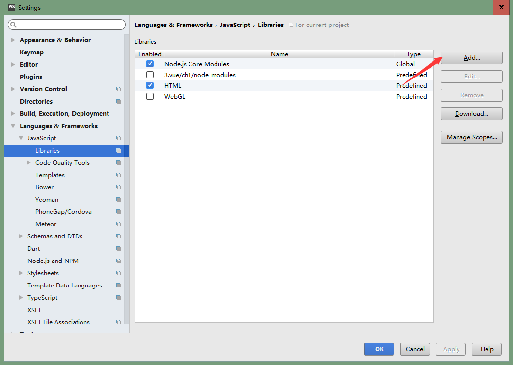

### 常用的一些包

下载

npm i expose-loader --save //辅助加载/加载配置的webpack组件

npm i postcss-loader --save //css预处理器

npm install jQuery --save

npm install bootstrap\@3.3.7 --save

**npm i weui --save** //weui css

npm i jquery-weui --save //weui js

**npm i font-awesome --save**

引入：

import 'jQuery/tmp/jquery.js';

import 'vue-awesome/dist/vue-awesome.js';

import 'bootstrap/dist/css/bootstrap.css'

import 'weui/dist/style/weui.min.css'

import 'jquery-weui/dist/js/jquery-weui.min.js'

\*npm i vue-awesome --save//awesome font字体库特别版\*1

1http://blog.csdn.net/gccll/article/details/72457829

### expose-loader

<https://webpack.js.org/loaders/expose-loader/>

For example, let's say you want to expose jQuery as a global called \$:

require("expose-loader?\$!jquery");

Thus, window.\$ is then available in the browser console.

\#引入bootstrap:https://www.cnblogs.com/LO-ME/p/7292635.html

npm run xxx
------------

终端输入`npm run xxx`时具体`xxx`对应的命令则根据`package.json`的配置：

```javascript
"scripts": {
    "dev": "node build/dev-server.js",
    "build": "node build/build.js",
    "unit": "karma start test/unit/karma.conf.js --single-run",
    "e2e": "node test/e2e/runner.js",
    "test": "npm run unit && npm run e2e",
    "lint": "eslint --ext .js,.vue src test/unit/specs test/e2e/specs"
  },

```

- 以下属于webpack的知识补充：

  `xxx`就是命令的快捷方式，免去每次都要输入很长的的命令 ，比如`unit`等价于执行：

  `karma start test/unit/karma.conf.js --single-run`

  - 只有这里配置的快捷方式才能run，所以不是所有的项目都能`npm run dev/build`。
  - 如果运行过程出现ERROR，就是因为在跑这些对应的脚本文件的时候，可能是某些依赖没有被加载等的
  - unit，就是开启karma去跑单元测试，具体测试内容，要去看karma.conf.js；
  - `e2e`就是end to end的端到端测试；
  - 而test则会将单元测试和端到端测试都执行。

有些项目中根据需要，还会配置其他命令，例如自动生成文档，比如[这里](https://github.com/JackGit/material-ui-vue/blob/master/package.json)：

`"build:doc": "node ./scripts/build-doc.js",`

如果你去`build-doc.js`中看的话，会发现，这个脚本在遍历所有源文件，解析注释和其他内容，自动生成[API文档](http://jackgit.github.io/material-ui-vue/)


vue目录结构
=======

| 基础目录                                 | 完整目录                                 |
|------------------------------------------|------------------------------------------|
| [./media/image2.png](./media/image2.png) | [./media/image3.png](./media/image3.png) |

.babelrc:

.editorconfig:声明排版格式

.gitignore:git排除的文件路径


### config

其中index.js此文件指定了前后端分离相关的配置：

var path = require('path')

module.exports = {

build: {// 构建产品时使用的配置

env: require('./prod.env'),// webpack的编译环境

index: path.resolve(__dirname, '../dist/index.html'),// 编译输入的index.html文件

assetsRoot: path.resolve(__dirname, '../dist'),// webpack输出的目标文件夹路径

assetsSubDirectory: 'static',// webpack编译输出的二级文件夹

assetsPublicPath: '/',// webpack编译输出的发布路径

productionSourceMap: true,// 使用SourceMap

// Gzip off by default as many popular static hosts such as

// Surge or Netlify already gzip all static assets for you.

// Before setting to \`true\`, make sure to:

// npm install --save-dev compression-webpack-plugin

productionGzip: false,// 默认不打开开启gzip模式

productionGzipExtensions: ['js', 'css'],// gzip模式下需要压缩的文件的扩展名

port: 9000

},

dev: {// 开发过程中使用的配置

env: require('./dev.env'),// webpack的编译环境

port: 8080,// dev-server监听的端口

assetsSubDirectory: 'static',

assetsPublicPath: '/',

proxyTable: {},// 请求代理表，在这里可以配置特定的请求代理到对应的API接口

// CSS Sourcemaps off by default because relative paths are "buggy"

// with this option, according to the CSS-Loader README

// (https://github.com/webpack/css-loader\#sourcemaps)

// In our experience, they generally work as expected,

// just be aware of this issue when enabling this option.

cssSourceMap: false // 是否开启 cssSourceMap

}

}

无法获取字体时，目前只需要理解：build指定app path，

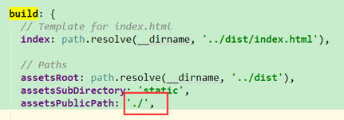

\${profile}.env.js，如：prod.env.js/test.env.js

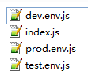

### 前端路径配置

<https://www.cnblogs.com/zhuzhenwei918/p/6866094.html>

vue生命周期
-----------

beforeCreate/created/beforeMount/mounted/

<https://segmentfault.com/a/1190000008010666>  


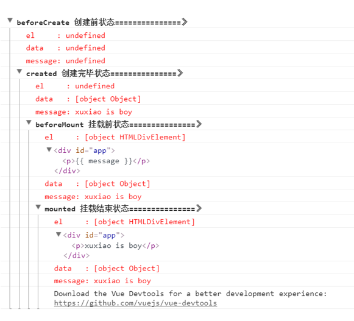

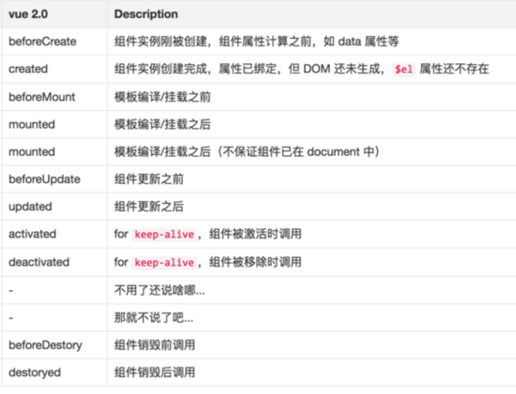

mvvm模式
--------

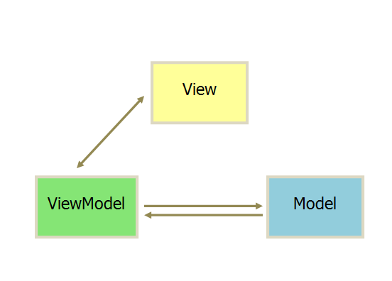

MVVM模式采用双向绑定（data-binding）：View的变动，自动反映在
ViewModel，反之亦然。[Vue](https://angularjs.org/)、[Angular](https://angularjs.org/)
都采用这种模式，相比于Angular，Vue.js提供了更加简洁、更易于理解的API，使得我们能够快速地上手并使用Vue.js；

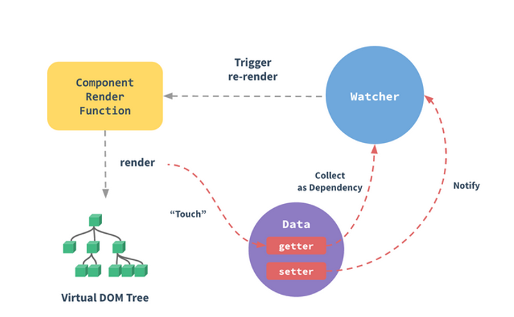

数据绑定的核心优势就是，可以用逻辑代码中的数据改变直接触发页面的变化，省去了传统使用的DOM操作，因为DOM操作比较麻烦，而且重复度高，因此省去了这个步骤，还是有蛮大帮助的。再来，数据驱动视图的思想很符合逻辑，界面中的变化实际上就是数据的变化引起的，如果业务逻辑中的数据变化可以直接反映到界面上，那么只要关注业务逻辑的处理就可以了。

# hello,world


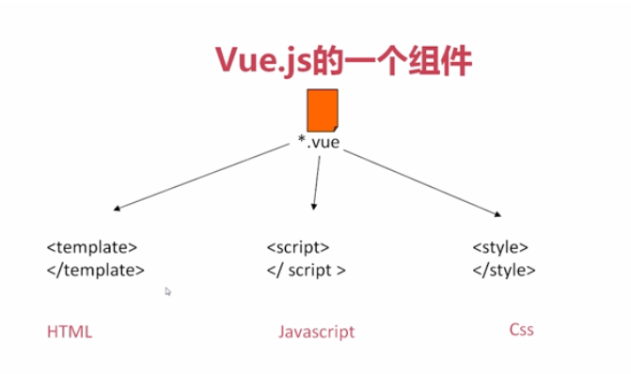

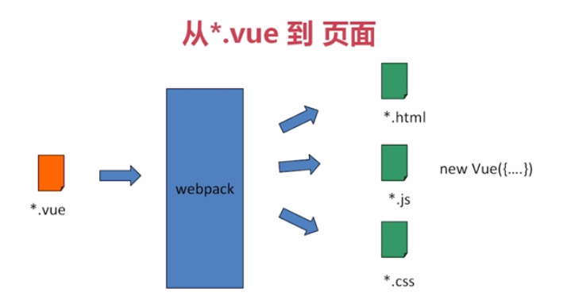

从vue初始化目录中,`app.vue`为入口父组件，通过

```
<router-view/>
```

引入`src/router/index.js`

```javascript
import Vue from 'vue'
import Router from 'vue-router'
import HelloWorld from '@/components/HelloWorld'

Vue.use(Router)

export default new Router({
  routes: [
    {
      path: '/',
      name: 'HelloWorld',
      component: HelloWorld
    }
  ]
})
```


# data & props

```vue
<script>
export default {
  data: function () {
    return {
      navItems:['HOME','ABOUT','CONTACT']
    }
  }
}
</script>
```

[api](https://cn.vuejs.org/v2/api/#data)

- **类型**：`Object | Function`
- **限制**：组件的定义只接受 `function`。

[`data` 必须是一个函数](https://cn.vuejs.org/v2/guide/components.html#data-%E5%BF%85%E9%A1%BB%E6%98%AF%E4%B8%80%E4%B8%AA%E5%87%BD%E6%95%B0)

当我们定义这个 `<button-counter>` 组件时，你可能会发现它的 `data` 并不是像这样直接提供一个对象：

```
data: {
  count: 0
}
```

取而代之的是，**一个组件的 data 选项必须是一个函数**，因此每个实例可以维护一份被返回对象的独立的拷贝：

```
data: function () {
  return {
    count: 0
  }
}
```

如果 Vue 没有这条规则，点击一个按钮就可能会像如下代码一样影响到*其它所有实例*


## props

```vue
<script>
// 简单语法
Vue.component('props-demo-simple', {
  props: ['size', 'myMessage']
})

// 对象语法，提供校验
Vue.component('props-demo-advanced', {
  props: {
    // 检测类型
    height: Number,
    // 检测类型 + 其他验证
    age: {
      type: Number,
      default: 0,
      required: true,
      validator: function (value) {
        return value >= 0
      }
    }
  }
})
</script>
```

- **类型**：`Array<string> | Object`

- **详细**：

vue组件之间相互独立，组件之间数据若要从父组件到子组件时采用[props](http://v.youku.com/v_show/id_XMjkxMTU1MDQ4OA==.html)，子向父传递是通过[自定义事件](https://www.cnblogs.com/daiwenru/p/6694530.html)；

子向父传递[另一个案例](https://www.jb51.net/article/132852.htm)
  props 可以是数组或对象，用于接收来自父组件的数据。props 可以是简单的数组，或者使用对象作为替代，对象允许配置高级选项，如类型检测、自定义校验和设置默认值。


data下的变量则是一个组件的实例属性，不会被覆盖。props里的变量会在render过程中被覆盖，因此只可读不可写。

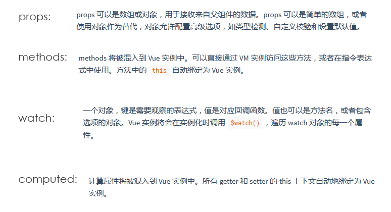


```
{text:"删除",icon:"remove"},

props:{isShow:{type:Boolean ,default:true}}
```

[prop默认值的问题](https://forum.vuejs.org/t/prop/875)


### 父子组件告警

[Vue warn]: Avoid mutating a prop directly since the value will be overwritten
whenever the parent component re-renders. Instead, use a data or computed
property based on the prop's value.

在父组件因某种原因重刷新[当父图表里的数据改变，需要重新init子组件]，此时子组件实例的变化会被覆盖；

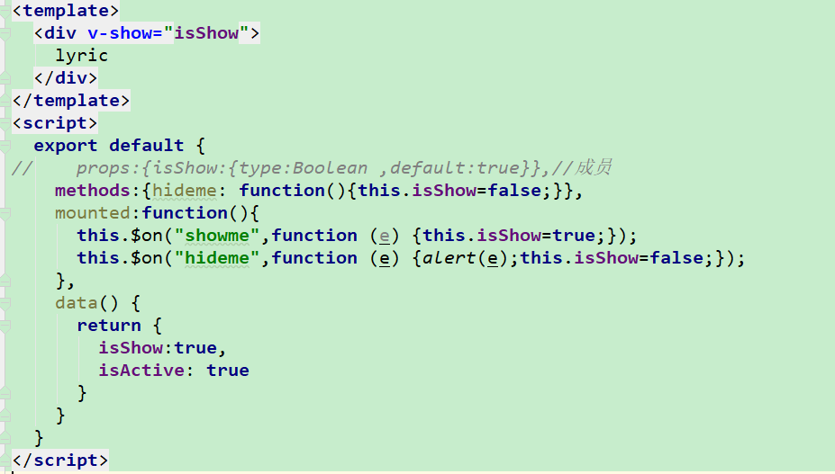

<https://stackoverflow.com/questions/43959824/instead-use-a-data-or-computed-property-based-on-the-props-value-vue-js>

## REF

\<YLyric \@click="click1" ref="ref1"\>\</YLyric\>

this.\$refs.ref1.hideme();

### 案例

>   一个常见的项目背景：

-   基于bootstrap可视化布局；

-   复用的vue 组件；

\<template\>  
\<a href="javascript:;" class="weui-tabbar__item weui-bar__item--on"\>  
\<span class="weui-badge" style="position: absolute;top: -.4em;right:
1em;"\>8\</span\>  
\<div class="weui-tabbar__icon"\>  
\</div\>  
\<p class="weui-tabbar__label"\>{{*text*}}\</p\>  
\</a\>  
\</template\>  
\<script\>  
export default {  
name: 'BottomTab',  
props:['text'],  
}  
\</script\>

用ref替换id来确保复用是可行的：

\<script\>

import mySelect from './MySelect.vue'

export default {

name: 'HelloWorld',

data () {

return {

msg: 'Welcome to Your Vue.js App23'

}

},

components:{

'mySelect':mySelect

}

}

\</script\>

模拟一个基础的样式

\<**mySelect :title="'**nihao'**" :todos="**[1,2,3]**"**\>\</**mySelect**\>

双引号里还有单引号；

import cmcc_filter from '../components/base/Filter'

配置router
==========

去除\#

mode:**'history'**,

指令
----

\<**YLyric ref="ref1"**\>\</**YLyric**\>

ref1

*\<!--如果要引入string，则需要再加一个单引号--\>*

### v-for


### v-on

我们知道，父组件使用 prop 传递数据给子组件。但子组件怎么跟父组件通信呢？这个时候
Vue
的自定义事件系统就派得上用场了。我们[使用 v-on 绑定自定义事件](https://cn.vuejs.org/v2/guide/components.html#%E4%BD%BF%E7%94%A8-v-on-%E7%BB%91%E5%AE%9A%E8%87%AA%E5%AE%9A%E4%B9%89%E4%BA%8B%E4%BB%B6)

子组件已经和它外部完全解耦了。它所做的只是报告自己的内部事件，因为父组件可能会关心这些事件。请注意这一点很重要。

#### 2018.3 ps优化案例

双向绑定：

-   计数器\$(".weui-badge").html

-   点击button-tab时 url跳转：

#### emit/eon(触发/注册监听)

vm.\$on( event, callback )

监听当前实例上的自定义事件。事件可以由vm.\$emit触发。回调函数会接收所有传入事件触发函数的额外参数。

vm.\$emit( event, […args] )

触发当前实例上的事件。附加参数都会传给监听器回调。

传统的trigger方法：

if(i==0){

\$(this).trigger("click");

}

<http://blog.csdn.net/m0_37068028/article/details/72898119>

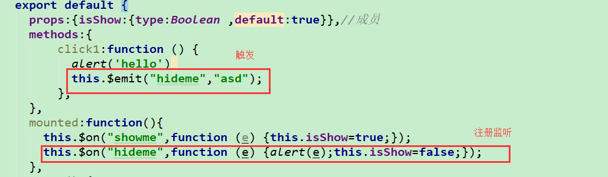

mounted: function () {  
this.\$on("showme", function (e) {this.isShow = true;});  
this.\$on("hideme", function (e) {this.isShow = false;});  
}

触发：

在本组件上触发：this.\$emit("myclick","123");//

在过渡组件触发：bus.\$emit("myclick","");//

监听：

\*在本组件上监听有两种方式：

1.在父组件上

\<c2 \@myclick=f2\>，使用f2监听c2的myclick事件；

无法在组件定义层使用\@定义，因为标签级别的原因

2.在组件定义上

this.\$on("myclick",this.f2)使用this.f2方法监听本组件的myclick事件

**在过渡组件上监听：**

bus.\$on();

通过过渡组件来承接 **事件触发/事件监**(\$emit/\$on)的流程：

创建src/common/bus.js

import Vue from 'vue';  
export default new Vue();

引入:

import bus from '\@/common/bus.js';

如子组件定义在点击的时候，通过\$emit执行自定义事件；

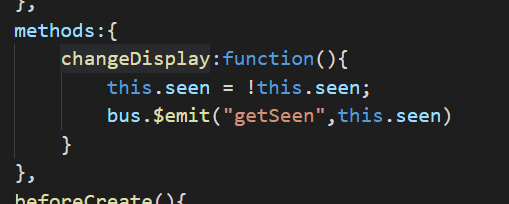

父组件通过\$on监听自定义事件;

\*取决于父链上的是否存在该事件的监听器以及事件处理程序返回的值；

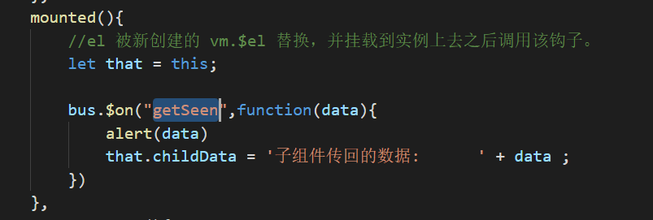

### v-bind

数据绑定最常见的形式就是使用 {{...}}（双大括号）插入文本：

使用v-html 指令用于输出 html 代码；

使用 v-bind :class对外提供控制**HTML 属性**

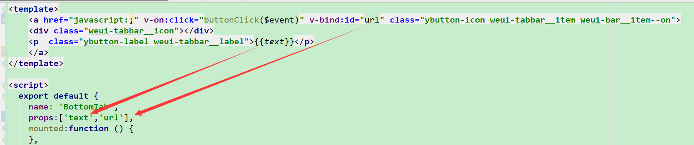

### v-model

指令来实现双向数据绑定，

v-model="message" 表示其绑定参数，可能为：

{{ message }}

v-html="message"

class="{'message': class1}"

v-model是v-bind和v-on的语法糖

\<input type="text" v-bind:value="dataA" v-on:input="dataA =
\$event.target.value" /\>

\<template\>  
\<div class="hello"\>  
\<label \>修改颜色\</label\>  
\<input type="checkbox" v-model="isActive" id="r1"\>  
\<br\>\<br\>  
\<div :class="{ active: isActive }"\>hello\</div\>  
\</div\>  
\</template\>  
\<style\>  
.active{  
background: \#444;  
color: \#eee;  
}  
\</style\>  
\<script\>  
export default {  
name: 'hello',  
data () {  
return {  
isActive : true  
}  
}  
}  
\</script\>

etltools
========

初始化
------

### webpack

### main.js

### App.vue


praiseslowly_mobile
===================

项目初始化
----------

D:\\toshiba\\dev\\2.h5\\3.vue\\ps1.3ui\>vue init webpack ps1.3ui

A newer version of vue-cli is available.

latest: 2.9.3

installed: 2.9.1

? Project name ps1.3ui

? Project description A Vue.js project

? Author yasz \<yaszyoyo\@gmail.com\>

? Vue build standalone

? Install vue-router? Yes

? Use ESLint to lint your code? No

? Set up unit tests No

? Setup e2e tests with Nightwatch? No

? Should we run \`npm install\` for you after the project has been created?
(recommended) npm

### 生产依赖

npm install jQuery --save

npm install bootstrap\@3.3.0 --save

**npm i weui --save** //weui css

npm i jquery-weui --save //weui js

**npm i font-awesome --save**

引入：

import 'jquery/jquery.min.js';

import 'bootstrap/dist/css/bootstrap.css'

import 'weui/dist/style/weui.min.css'

import 'jquery-weui/dist/js/jquery-weui.min.js'

TABBAR样式
----------

\<a href="javascript:;" class="weui-tabbar__item"\>  
\<div class="weui-tabbar__icon"\>\</div\>  
\<p class="weui-tabbar__label"\>我\</p\>

HelloWorld.vue设计方法，设置

\<div class="weui-tabbar"\>

\<BottomTab \@click.native="clickBtnLyric" :text="'lyric'"\>\</BottomTab\>

\<BottomTab \@click.native="clickBtnTemplate" :text="'模板'"\>\</BottomTab\>

\<BottomTab \@click.native="clickBtnExport" :text="'导出'"\>\</BottomTab\>

\<BottomTab \@click.native="clickBtnAboutme" :text="'我'"\>\</BottomTab\>

\</div\>

初始化

iconInit: function () {

/\*\*

\* created by yang on 15:35 2018/1/24.

\* describtion:初始化按钮

\*/

var iconName = ['file', 'bars', 'file-powerpoint-o', 'heart-o'];

\$('.weui-tabbar__icon').each(function (i) {

\$(this).addClass('fa fa-fw fa-' + iconName[i]);

if(i==0){

\$(this).trigger("click");

}

})

}

},

### URL页面跳转

思路1：

创建三个页面，每个页面都需要创建多个组件页面，弊端比较明显：页面上任意模板修改，都需要修改N个组件；

思路2：

只用一个页面，通过router-link绑定url，组件读取url过程进行判断隐藏；

<https://router.vuejs.org/zh-cn/essentials/passing-props.html>

在 ready () 中 异步加载数据，路由跳转之后再回来，会重新调用 ready ()
方法加载数据。  
如何能够让 页面状态 保持，只在第一次渲染的时候调用 ready () 方法？

keep-alive <https://github.com/vuejs/vue-router/issues/328>

### 程序思路

按钮绑定url切换事件，

\<BottomTab \@click.native="clickBtnLyric" :text="'lyric'"\>\</BottomTab\>

clickBtnLyric:function () {  
this.\$router.push('/page/lyric')  
},

切换后在路由更新事件后，通过\$route.params.pagename获取页面名称，将对应绑定页面组件vloopup设置为true即可。

beforeRouteUpdate (to, from, next) {  
next();  
**this**.routeUpdate();  
},

routeUpdate: **function** () {  
*/\*\**  
*\* created by yang on 15:35 2018/1/24.*  
*\* describtion:url修改后的刷新事件*  
*\*/*  
**this**.**showLyric** = **false**;  
**this**.**showTemplate** = **false**;  
**this**.**showExport** = **false**;  

**switch** (**this**.\$route.params.pagename) {  
**case 'lyric'**:**this**.**showLyric** = **true**;**break**;  
**case 'template'**:**this**.**showTemplate** = **true**;**break**;  
**case 'export'**:**this**.**showExport** = **true**;**break**;  
}  
},

#### 2018.3优化思路

1.将url绑定在一个隐藏的标签中

### Q&A awesome-font不显示

#### npm run dev模式

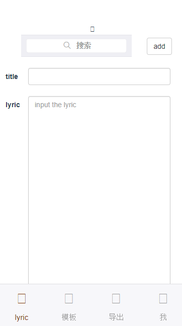

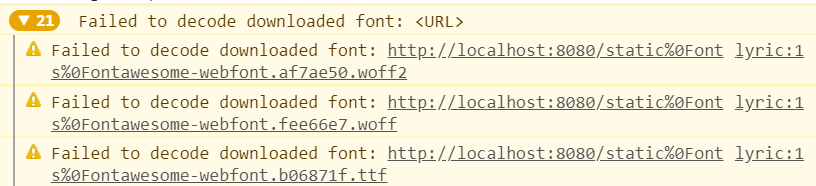

此问题的原因在于设置webpack.base.conf.js大小问题；

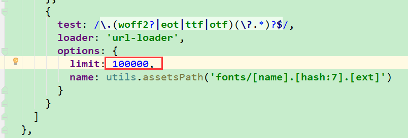

另外webpack.base.conf 里设置assetsPublicPath:'/' 

https://github.com/vuejs/vue-cli/issues/179

#### npm run build模式

-   nginx字体mime设置；

<https://router.vuejs.org/zh-cn/essentials/history-mode.html>

-   style被覆盖：修改class名称后故障依旧

在app.vue引入自定义样式覆盖

\<style\>  
\@import './common/css/common.css';  
\</style\>

common.css

\#app {  
font-family: 'Avenir', Helvetica, Arial, sans-serif;  
-webkit-font-smoothing: antialiased;  
-moz-osx-font-smoothing: grayscale;  
text-align: center;  
color: \#2c3e50;  
margin-top: 60px;  
}  
.weui-search-bar__cancel-btn {  
color: black;  
}  

.ylyric-label{  
padding-top:6px;  
padding-right:30px;  
}  

.ylyric-btn{  
margin-top:6px  
}  

.ybutton-icon{  
font-size: 30px;  
}  

.ybutton-label{  
font-size: 15px; color:\#999999;  
}  


a, a:hover, a:active, a:visited, a:focus {  
text-decoration:none;  
}

main.js中

.App最后引入

<https://github.com/vuejs/vue/issues/7616>

-   scoped：<https://github.com/vuejs/vue-loader/issues/749>

通过命名空间使得仅在本组件生效，

### Q&A History mode模式中页面无法渲染的原因及解决

<http://blog.csdn.net/xjlinme/article/details/74783887>

<https://juejin.im/post/59ca4b96f265da0668760b60>

路由history模式。

<https://router.vuejs.org/zh-cn/essentials/history-mode.html>

导出页（components\\page\\YExport.vue）
---------------------------------------

### 下拉列表

list

<https://getbootstrap.com/docs/4.0/components/list-group/>

<http://v3.bootcss.com/css/#tables>

**拖拽LIST:**

cnpm install vuedraggable --save

<https://github.com/SortableJS/Vue.Draggable>

<https://segmentfault.com/a/1190000010078042>

用draggable包裹被拖拽的元素,options是拖拽效果行为的相关配置，和sortable的配置基本完全一样，start
end move是相关事件;

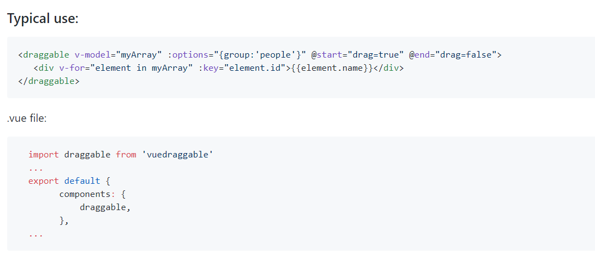

**下载插件：**

cnpm install jquery-file-download --save

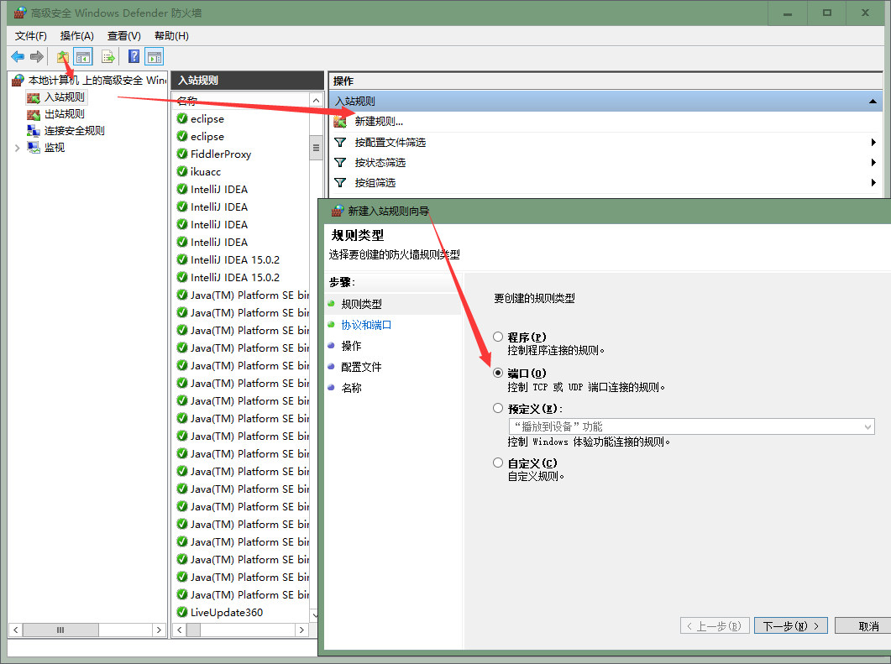

选择端口-\>TCP-\>输入特定端口80-\>允许链接-\>设置可访问的网络类型（可全选）-\>输入名称（如HTTP）-\>完成

### TODO

TODO:拖拽删除；

**TODO:点击回到lyric编辑；**

n18I词库
========

https://nuxt-community.github.io/nuxt-i18n/


lyric=歌词

tmplate=模板

output=输出

searrch_tt=支持首拼("qyed-"\>奇异恩典)

奇异恩典何等甘甜

我罪已得赦免

前我失丧今得寻回

瞎眼今得看见

如此恩典使我敬畏

使我心得安慰

初信之时我蒙恩惠

真是何等宝贵

许多危险 劳苦重担  

今日已经脱离

全靠主恩 大得平安

并领我回家去

将来禧年 圣徒欢聚

恩光爱谊千年

喜乐颂赞 在父座前

深望那日快现

奇异恩典何等甘甜

我罪已得赦免

前我失丧今得寻回

瞎眼今得看见

如此恩典使我敬畏

使我心得安慰

初信之时我蒙恩惠

真是何等宝贵

许多危险 劳苦重担  

今日已经脱离

全靠主恩 大得平安

并领我回家去

将来禧年 圣徒欢聚

恩光爱谊千年

喜乐颂赞 在父座前

深望那日快现
